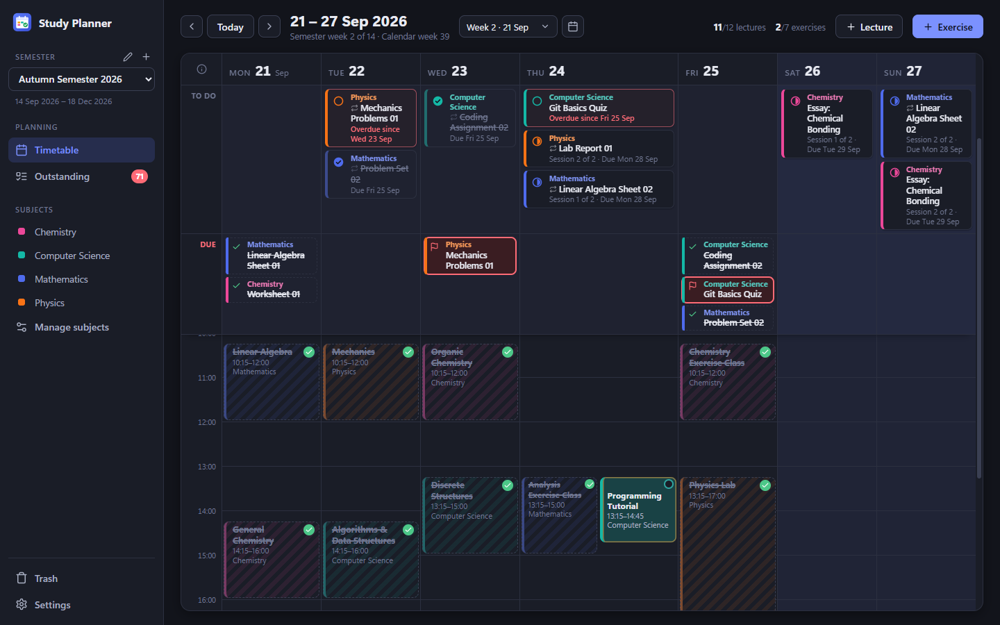
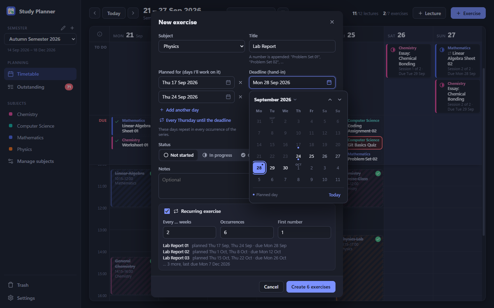
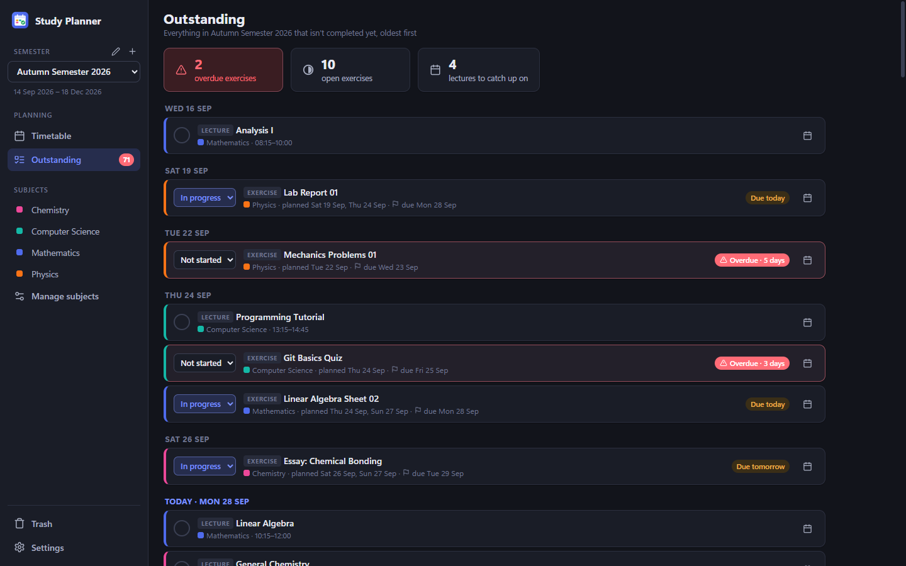
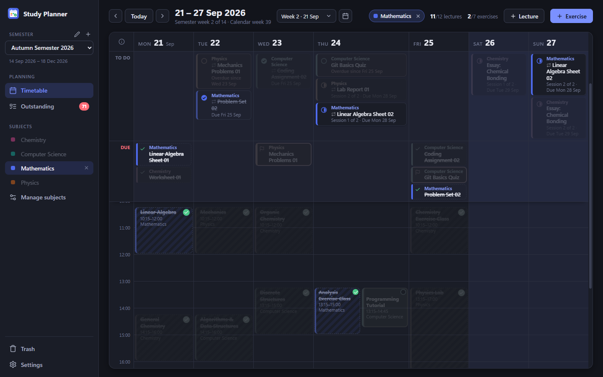
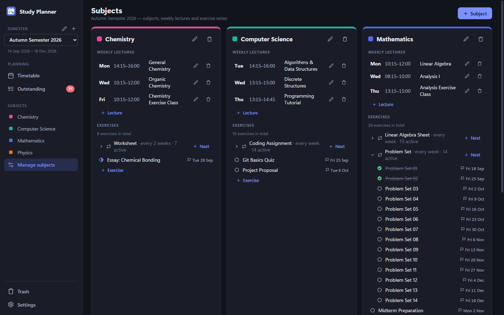
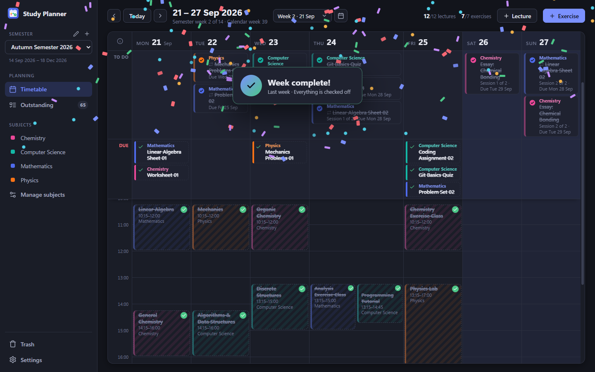

<div align="center">


# Study Planner

**Plan your university semester around a visual weekly timetable.**<br>
Track which lectures you've completed, plan when you'll work on each exercise, and never lose sight of a deadline.

Windows desktop app · works fully offline · your data stays on your PC



</div>

## Features

- **Weekly timetable**: Monday to Sunday in 24-hour time, showing lectures, the exercises you plan to work on and hand-in deadlines in one view.
- **Lecture tracking**: lectures repeat every week of the semester. Click a lecture to mark that week's session as completed.
- **Exercise planning**: every exercise has a deadline and one or more days you plan to work on it. Drag an exercise to another day to reschedule it; the app won't let you plan past the deadline.
- **Recurring exercises**: create a whole series at once (`Problem Set 01`, `02`, …), weekly or every few weeks. You can change one occurrence, the following ones, or the whole series.
- **Focus on one subject**: click a subject in the sidebar to grey out everything else in the timetable and see only its open items.
- **Little celebrations**: a soft ding for every lecture or exercise you check off, a burst of confetti when you've completed all lectures or all exercises of a week, and a bigger one when the whole week is done. The sound can be turned off in Settings.
- **Outstanding list**: everything you haven't finished yet, oldest first, with overdue exercises highlighted.
- **Multiple semesters**: each semester and its subjects stay separate, and old semesters remain available.
- **Safe with your data**: deleted items go to a trash bin first, the database is backed up automatically, and updates keep everything you've entered.

## Screenshots

| Plan recurring exercises | See what's still open |
|---|---|
|  |  |

| Focus on one subject | Manage your subjects |
|---|---|
|  |  |



## Installation

1. Download `Study Planner Setup <version>.exe` from the [Releases](../../releases) page.
2. Run the installer. It installs for your user account and adds a desktop and Start-menu shortcut.

The installer isn't code-signed, so Windows SmartScreen may show a warning the first time. Choose **More info → Run anyway**.

To update, install the newer version over the old one. Your data is kept.

## Your data

Everything is stored locally in a SQLite database in `%APPDATA%\StudyPlanner\`, separate from the program itself. There's no account and no cloud, and no internet connection is needed.

- A backup is saved automatically once a day (the last 14 are kept) and before every database upgrade.
- **Settings → Data & backups** in the app shows the exact location and can create a backup on demand.
- To restore a backup, close the app, copy the backup file over `study-planner.db`, and delete any `study-planner.db-wal` and `study-planner.db-shm` files next to it.

## Building from source

Requires Windows and [Node.js](https://nodejs.org) 22 or newer.

```sh
npm install
npm run dev      # run the app with live reload (uses a separate development data folder)
npm test         # run the tests
npm run dist     # build the installer into release/
```

Built with Electron, React, TypeScript and SQLite. [CLAUDE.md](CLAUDE.md) describes the architecture, data model and the rules for changing the database; [CHANGELOG.md](CHANGELOG.md) lists what changed in each version.

## License

[MIT](LICENSE) © 2026 Silvan Meier
